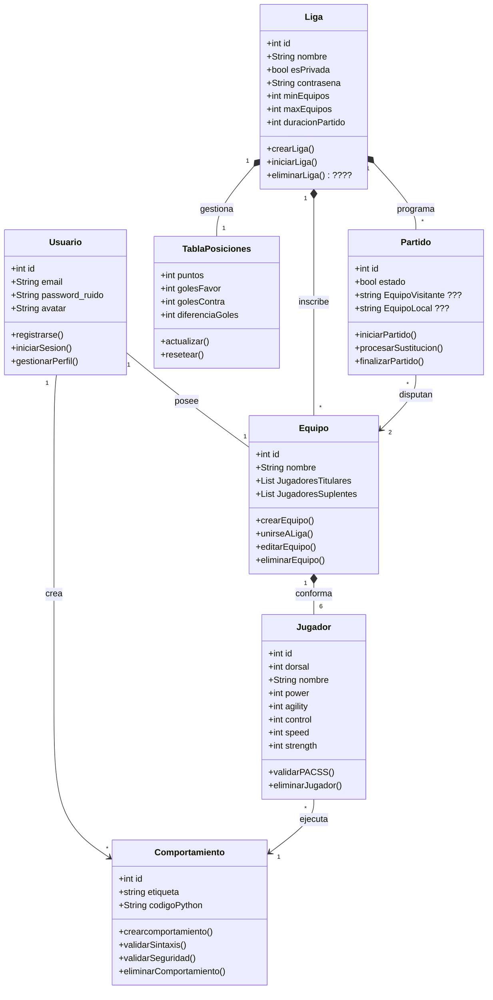

```mermaid
classDiagram
    class Usuario {
        +int id
        +String email
        +String password_ruido
        +String avatar

        +registrarse()
        +iniciarSesion()
        +gestionarPerfil()
    }

    class Equipo {
        +int id
        +String nombre
        +List JugadoresTitulares
        +List JugadoresSuplentes

        +crearEquipo()
        +unirseALiga()
        +editarEquipo()
        +eliminarEquipo()
    }

    class Jugador {
        +int id
        +int dorsal
        +String nombre
        +int power
        +int agility
        +int control
        +int speed
        +int strength

        +validarPACSS()
        +eliminarJugador()
    }

    class Comportamiento {
        +int id
        +string etiqueta
        +String codigoPython
        +crearcomportamiento()

        +validarSintaxis()
        +validarSeguridad()
        +eliminarComportamiento()
    }

    class Liga {
        +int id
        +String nombre
        +bool esPrivada
        +String contrasena
        +int minEquipos
        +int maxEquipos
        +int duracionPartido

        +crearLiga()
        +iniciarLiga()
        +eliminarLiga() ????
    }

    class TablaPosiciones {
        +int puntos
        +int golesFavor
        +int golesContra
        +int diferenciaGoles
        
        +actualizar()
        +resetear()
    }

    class Partido {
        +int id
        +bool estado 
        +string EquipoVisitante     ???
        +string EquipoLocal     ???

        +iniciarPartido()
        +procesarSustitucion()
        +finalizarPartido()
    }

    Usuario "1" -- "1" Equipo : posee

    Usuario "1" --> "*" Comportamiento : crea

    Equipo "1" *-- "6" Jugador : conforma

    Jugador "*" --> "1" Comportamiento : ejecuta

    Liga "1" *-- "*" Equipo : inscribe

    Liga "1" *-- "1" TablaPosiciones : gestiona

    Liga "1" *-- "*" Partido : programa

    Partido "*" --> "2" Equipo : disputan

```
