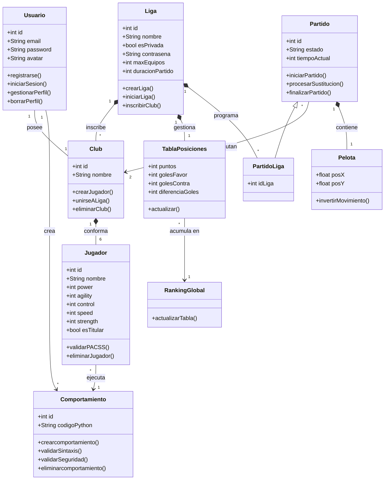

```mermaid

classDiagram

    class Usuario {

        +int id

        +String email

        +String password

        +String avatar

        +registrarse()

        +iniciarSesion()

        +gestionarPerfil()

        +borrarPerfil()

    }


    class Club {

        +int id

        +String nombre

        +crearJugador()

        +unirseALiga()

        +eliminarClub()

    }


    class Jugador {

        +int id

        +String nombre

        +int power

        +int agility

        +int control

        +int speed

        +int strength

        +bool esTitular

        +validarPACSS()

        +eliminarJugador()

    }


    class Comportamiento {

        +int id

        +String codigoPython

        +crearcomportamiento()

        +validarSintaxis() 

        +validarSeguridad()

        +eliminarcomportamiento()

    }


    class Liga {

        +int id

        +String nombre

        +bool esPrivada

        +String contrasena

        +int maxEquipos

        +int duracionPartido

        +crearLiga()

        +iniciarLiga()

        +inscribirClub()

    }


    class TablaPosiciones {

        +int puntos

        +int golesFavor

        +int golesContra

        +int diferenciaGoles

        +actualizar()

    }


    class RankingGlobal {

        +actualizarTabla()

    }


    class Partido {

        +int id

        +String estado

        +int tiempoActual

        +iniciarPartido()

        +procesarSustitucion()

        +finalizarPartido()

    }


    class PartidoLiga {

        +int idLiga

    }


    class Pelota {

        +float posX

        +float posY

        +invertirMovimiento()

    }


    Usuario "1" -- "1" Club : posee

    Usuario "1" --> "*" Comportamiento : crea

    Club "1" *-- "6" Jugador : conforma

    Jugador "*" --> "1" Comportamiento : ejecuta

    Liga "1" *-- "*" Club : inscribe

    Liga "1" *-- "1" TablaPosiciones : gestiona

    TablaPosiciones "*" --> "1" RankingGlobal : acumula en

    Partido <|-- PartidoLiga

    Liga "1" *-- "*" PartidoLiga : programa

    Partido "*" --> "2" Club : disputan

    Partido "1" *-- "1" Pelota : contiene

```
