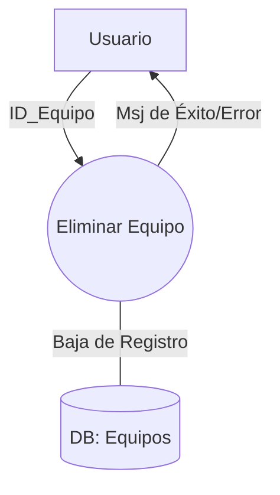
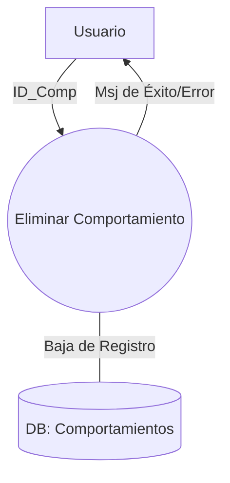

### Caso de uso #9: Eliminar equipo

**Descripcion:** Permite a un usuario remover un equipo existente del sistema.

| Atributo | Detalle |
|:---|:---|
|**Actor Primario**|Usuario|
|**Actor Secundario**|Sistema|
|**Precondicion**|El Usuario debe estar autenticado y debe existir al menos un equipo registrado en el sistema.|

#### Escenario Exitoso 

1. El Usuario selecciona el equipo que desea eliminar de la lista. 
2. El Usuario preciona el boton 'Eliminar Equipo'.
3. El Sistema solicita confirmacion para seguir con la accion.
4. El Usuario confirma la accion.
5. El Sistema elimina el equipo de la base de datos.
6. El Sistema muestra mensaje indicando la eliminacion exitosa del equipo.

#### Escenarios Excepcionales
* **3a. El Usuario Cancela la confirmacion:**
    1. El Sistema cancela la operacion sin modificar los datos.
    2. El Sistema regresa a la lista de equipos.
* **5a El Sistema no puede eliminar el equipo:**
    1. El Sistema detecta el fallo al intentar borrar el registro.
    2. El Sistema muestra un mensaje de error notificando que no se pudo eliminar el equipo.
    3. El equipo permanece registrado en el sistema 

#### DFD

### Caso de uso #11: Eliminar Comportamiento
**Descripcion:** Permite al Usuario remover un comportamiento del sistema.

| Atributo | Detalle |
|:---|:---|
|**Actor Primario**|Usuario|
|**Actor Secundario**|Sistema|
|**Precondicion**|El Usuario debe estar autenticado, debe existir al menos un comportamiento registrado en el sistema.|

#### Escenario Exitoso

1. El Usuario selecciona el comportamiento que desea eliminar de la lista. 
2. El Usuario preciona el boton 'Eliminar Comportamiento'.
3. El Sistema solicita confirmacion para seguir con la accion.
4. El Usuario confirma la accion.
5. El Sistema elimina el Comportamiento de la base de datos.
6. El Sistema muestra mensaje indicando la eliminacion exitosa del comportamiento.

#### Escenarios Excepcionales

* **3a. El Usuario Cancela la confirmacion:**
    1. El Sistema cancela la operacion sin modificar los datos.
    2. El Sistema regresa a la lista de comportamientos.
* **5a El Sistema no puede eliminar el equipo:**
    1. El Sistema detecta el fallo al intentar borrar el comportamiento de la Base de Datos.
    2. El Sistema muestra un mensaje de error notificando que no se pudo eliminar el Comportamiento.
    3. El Comportamiento permanece registrado en el sistema.
* **5b El Comportamiento elegido esta en uso**
    1. El Sistema detecta vinculo del comportamiento con un jugador activo.
    2. El Sistema muestra mensaje de error notificando que jugador/es estan usando dicho comportamiento.
    3. El Comportamiento permanece registrado en el sistema.

#### DFD
