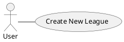

### Diagram

### Actor
* User
### Brief Description
The user wants to create a new league for teams to play against each other.
### Preconditions
1. The user is logged in.
2. The user is on the main menu.
3. The user has the minimum numbers of teams to join, and each team must be made of 3 Main players and 3 Replacement players.
4. The team is not playing in another league.
### Inputs
1. League name
2. Match duration
3. ==Match start==
4. Minimum of teams
5. Maximum of teams
6. Password (optional)
7. User's team(s)
### Successful scenarios
1. The user clicks "Create new league" button.
2. The system displays a league creation form, requiring League name, Match duration, Minimum of teams, Maximum of teams, an optional Password, and the team(s) the user will be participating as.
3. User enters fills required fields and clicks submit.
4. System validates the inputs and verifies:
	1. The minimum of participating teams is at least 3
	2. The maximum of participating teams is less than ==consult==
	3. The match duration is at least ==consult== minutes.
	4. ==The match starting date is greater than a minute from now.==
	5. The team(s) the user participate as are not participating in another league.
5. System displays a confirmation message and redirects to the newly created league page.
### Exceptional scenarios
#### Exception 1: Missing or invalid field(s)
* Trigger: Step 4 of the Main Flow (input verification fails)
* Flow: The system highlights the missing or invalid fields with error messages, and prompts the user to correct them and try again
#### Exception 2: 